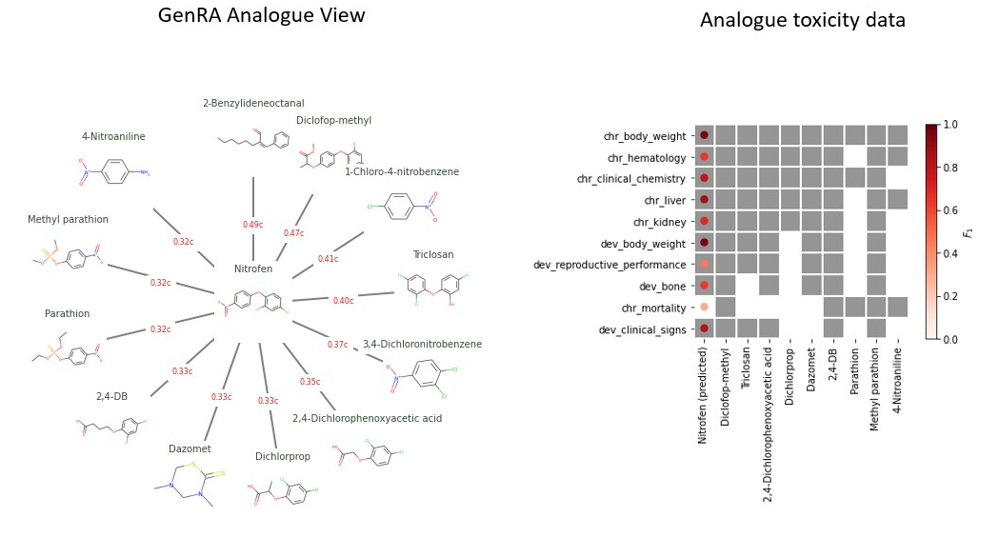

# Generalised Read-Across (GenRA) in Python 

[Read-Across](https://www.oecd.org/env/ehs/risk-assessment/groupingofchemicalschemicalcategoriesandread-across.htm) is widely used to fill data-gaps for untested chemicals. We developed [Genralised Read-Across (GenRA)](https://doi.org/10.1016/j.yrtph.2019.104480) as a computational toxicology tool to mimic a human expert’s manual reasoning based on similarity-weighted activity. This repository contains a Python 3 implementation for GenRA, called genra-py, which is based on the [scikit-learn](https://scikit-learn.org) [estimator](https://scikit-learn.org/stable/modules/generated/sklearn.base.BaseEstimator.html?highlight=estimator#sklearn.base.BaseEstimator). We also describe two potential uses-cases for genra-py that uses published chemical structure, bioactivity and toxicity data.   

# Easy starts 
`pip install genra`

or try our Docker image from on dockerhub at https://hub.docker.com/r/patlewig/genra-py:0.1.0

The image contains the scipy Jupyter notebook, RDKit and a pip installable version of genra-py (https://github.com/i-shah/genra-py/). 

In a terminal type:

`docker run --rm -p 8888:8888 -e JUPYTER_ENABLE_LAB=yes --user $(id -u):$(id -g) --group-add users -v "$PWD":/home/jovyan patlewig/genra-py`

Copy/paste the resulting url link into a new browser window. This should start the Jupyter lab session from your current working directory.

# Alternatives

Running the notebooks in this repository requires Python 3, [Anaconda](https://www.anaconda.com/), [Jupter](https://jupyter.org/)  and some additional configuration. 

1. Install Python 3, anaconda/conda and Jupyter Lab
2. Clone this repo: \
   `git clone https://github.com/i-shah/genra-py.git`
3. Go into genra-py directory and create *genra-py* conda environment: \
   `make -n create_environment`
4. Activate conda environment:\
   `conda activate genra-py`
5. Add this conda environment as a kernel to jupyter-lab: \
   `ipython kernel install --user --name=genra-py`
6. Copy the notebooks/dotenv file to notebooks/.env and edit the environemnt variables (replace path_to_top with the correct directory name):\
    `TOP=path_to_top/genra-py
    SRC=path_to_top/genra-py/src
    DAT=path_to_top/genra-py/data
    FIG=path_to_top/genra-py/figs
    `

Further details are provided in the notebooks/manual directory. 

See https://github.com/patlewig/UNC_Rax and run the example using the Binder https://mybinder.org/

# Project Organization

    ├── LICENSE
    ├── Makefile           <- Makefile with commands like `make data` or `make train`
    ├── README.md          <- The top-level README for developers using this project.
    ├── data               <- Data from public domain sources.
    │   └─ shah-2016       <- Data from https://doi.org/10.1016/j.yrtph.2016.05.008
    │   └─ helman-2019     <- Data from https://doi.org/10.1016/j.yrtph.2016.05.008
    |
    ├── notebooks          <- Jupyter notebooks 
    |   |                     
    |   ├─dotenv           <- copy this to ".env" and edit this file
    |   ├─app-note         <- use-cases described in manuscript
    |   └─manual           <- user-manual as a jupyter notebook
    │
    ├── requirements.txt   <- The requirements file for reproducing the analysis environment, e.g.
    │                         generated with `pip freeze > requirements.txt`
    ├── genra-py.yml       <- The spec for creating a conda environment.
    |                          conda env create -f condaenv.yml
    ├── dist               <- Source and Wheel Distributions
    |
    └── genra              <- Source code  
            ├─chm          <- Chemical structure processing
            ├─rax          <- Read Across prediction
            └─utl          <- Utilities
            
           
